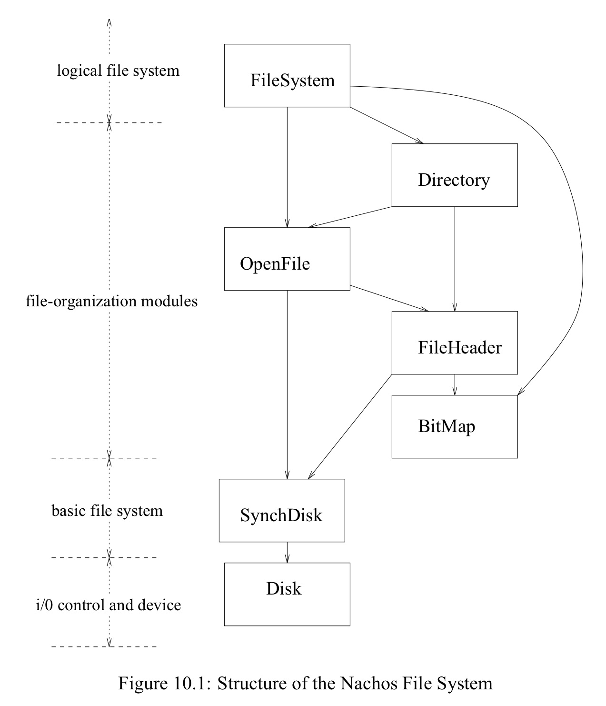

# Lab 5: File System

> Recommendation of this Lab
>
> 1. Modify and management of the data structure
>     * Adding the file attribute => modify file header
>     * Hierarchical directory should be able to create directory or file
>       * Initialize the file header message by its file type
> 2. When implementing hierarchical (multi-level) directory:
>     * The meaning of the directory file
>       * Each directory match a file. Use the file can get the parent and children directory information
>     * The directory file size is pre-defined, but in practice the size should based on the content and can be changed
>     * After implement the hierarchical directory, add or delete the directory entry must according specific path (it's important to understand the "tree traversal")
> 3. To implement the infinity file length, it's good to try to use mixed indexed allocation method

Test the original file system:

* Before format the disk (or delete the `code/filesys/DISK` file)

    ```txt
    $ docker run -it nachos_filesys nachos/nachos-3.4/code/filesys/nachos -D
    Bit map file header:
    FileHeader contents.  File size: 0.  File blocks:

    File contents:
    Directory file header:
    FileHeader contents.  File size: 0.  File blocks:

    File contents:
    Bitmap set:

    Directory contents:
    ```

* Format the disk and show the debug message

    ```txt
    $ docker run -it nachos_filesys nachos/nachos-3.4/code/filesys/nachos -f -d d
    Initializing the disk, 0x8054a56 0x818f258
    Request latency = 16480
    Writing to sector 0
    Writing sector: 0
    80 1 2 0 0 0 0 0 0 0 0 0 0 0 0 0 0 0 0 0 0 0 0 0 0 0 0 0 0 0 0 0
    Updating last sector = 0, 0
    Request latency = 16470
    Writing to sector 1
    Writing sector: 1
    c8 2 3 4 0 0 0 0 0 0 0 0 0 0 0 0 0 0 0 0 0 0 0 0 0 0 0 0 0 0 0 0
    Updating last sector = 1, 0
    Request latency = 500
    Reading from sector 0
    Reading sector: 0
    80 1 2 0 0 0 0 0 0 0 0 0 0 0 0 0 0 0 0 0 0 0 0 0 0 0 0 0 0 0 0 0
    Updating last sector = 0, 0
    Request latency = 500
    Reading from sector 1
    Reading sector: 1
    c8 2 3 4 0 0 0 0 0 0 0 0 0 0 0 0 0 0 0 0 0 0 0 0 0 0 0 0 0 0 0 0
    Updating last sector = 1, 0
    Request latency = 15410
    Writing to sector 2
    Writing sector: 2
    1f 0 0 0 0 0 0 0 0 0 0 0 0 0 0 0 0 0 0 0 0 0 0 0 0 0 0 0 0 0 0 0
    Updating last sector = 2, 0
    Request latency = 500
    Reading from sector 4
    Reading sector: 4
    0 0 0 0 0 0 0 0 0 0 0 0 0 0 0 0 0 0 0 0 0 0 0 0 0 0 0 0 0 0 0 0
    Updating last sector = 4, 0
    Request latency = 15940
    Writing to sector 3
    Writing sector: 3
    0 0 0 0 0 0 0 0 0 0 0 0 0 0 0 0 0 0 0 0 0 0 0 0 0 0 0 0 0 0 0 0
    Updating last sector = 3, 0
    Request latency = 16470
    Writing to sector 4
    Writing sector: 4
    0 0 0 0 0 0 0 0 0 0 0 0 0 0 0 0 0 0 0 0 0 0 0 0 0 0 0 0 0 0 0 0
    Updating last sector = 4, 0
    ```

* Format and show the directory

    ```txt
    $ docker run -it nachos_filesys nachos/nachos-3.4/code/filesys/nachos -f -D  
    Bit map file header:
    FileHeader contents.  File size: 128.  File blocks:
    2
    File contents:
    \1f\0\0\0\0\0\0\0\0\0\0\0\0\0\0\0\0\0\0\0\0\0\0\0\0\0\0\0\0\0\0\0\0\0\0\0\0\0\0\0\0\0\0\0\0\0\0\0\0\0\0\0\0\0\0\0\0\0\0\0\0\0\0\0\0\0\0\0\0\0\0\0\0\0\0\0\0\0\0\0\0\0\0\0\0\0\0\0\0\0\0\0\0\0\0\0\0\0\0\0\0\0\0\0\0\0\0\0\0\0\0\0\0\0\0\0\0\0\0\0\0\0\0\0\0\0\0\0
    Directory file header:
    FileHeader contents.  File size: 200.  File blocks:
    3 4
    File contents:
    \0\0\0\0\0\0\0\0\0\0\0\0\0\0\0\0\0\0\0\0\0\0\0\0\0\0\0\0\0\0\0\0\0\0\0\0\0\0\0\0\0\0\0\0\0\0\0\0\0\0\0\0\0\0\0\0\0\0\0\0\0\0\0\0\0\0\0\0\0\0\0\0\0\0\0\0\0\0\0\0\0\0\0\0\0\0\0\0\0\0\0\0\0\0\0\0\0\0\0\0\0\0\0\0\0\0\0\0\0\0\0\0\0\0\0\0\0\0\0\0\0\0\0\0\0\0\0\0
    \0\0\0\0\0\0\0\0\0\0\0\0\0\0\0\0\0\0\0\0\0\0\0\0\0\0\0\0\0\0\0\0\0\0\0\0\0\0\0\0\0\0\0\0\0\0\0\0\0\0\0\0\0\0\0\0\0\0\0\0\0\0\0\0\0\0\0\0\0\0\0\0
    Bitmap set:
    0, 1, 2, 3, 4,
    Directory contents:
    ```

* Copy file to disk and print

    ```txt
    $ docker run -it nachos_filesys nachos/nachos-3.4/code/filesys/nachos -f -cp nachos/nachos-3.4/code/filesys/test/big big -p big
    This is the spring of our discontent.
    This is the spring of our discontent.
    This is the spring of our discontent.
    This is the spring of our discontent.
    This is the spring of our discontent.
    This is the spring of our discontent.
    This is the spring of our discontent.
    This is the spring of our discontent.
    This is the spring of our discontent.
    This is the spring of our discontent.
    This is the spring of our discontent.
    This is the spring of our discontent.
    This is the spring of our discontent.
    This is the spring of our discontent.
    This is the spring of our discontent.
    This is the spring of our discontent.
    ```

* Run my test script that I put in `code/filesys/test/my_test_script1.sh` using `docker run -it nachos_filesys nachos/nachos-3.4/code/filesys/test/my_test_script1.sh` (I've set it to executable file). Here is the content of the script.
  
    > I've add additional `-Q` flag functionality in `code/threads/main.cc` that will disable the verbose message of machine. It's useful when we execute multiple file system commands and it won't be mess.

    ```sh
    #!/bin/sh
    # goto filesys/ in docker
    cd /nachos/nachos-3.4/code/filesys

    # use -Q to disable verbose machine messages
    echo "=== format the DISK ==="
    ./nachos -Q -f
    echo "=== copies file \"big\" from UNIX to Nachos ==="
    ./nachos -Q -cp test/big big
    # Files: big
    echo "=== copies file \"small\" from UNIX to Nachos ==="
    ./nachos -Q -cp test/small small
    # Files: big, small
    echo "=== lists the contents of the Nachos directory ==="
    ./nachos -Q -l
    # big
    # small
    echo "=== remove the file \"big\" from Nachos ==="
    ./nachos -Q -r big
    echo "=== print the content of file \"small\" ==="
    ./nachos -Q -p small
    echo "=== prints the contents of the entire file system ==="
    ./nachos -Q -D
    echo "=== tests the performance of the Nachos file system ==="
    ./nachos -Q -t
    ```

    ```txt
    $ docker run -it nachos_filesys nachos/nachos-3.4/code/filesys/test/my_test_script1.sh
    === format the DISK ===
    === copies file "big" from UNIX to Nachos ===
    === copies file "small" from UNIX to Nachos ===
    === lists the contents of the Nachos directory ===
    big
    small
    === remove the file "big" from Nachos ===
    === print the content of file "small" ===
    This is the spring of our discontent.
    === prints the contents of the entire file system ===
    Bit map file header:
    FileHeader contents.  File size: 128.  File blocks:
    2
    File contents:
    \1f\18\0\0\0\0\0\0\0\0\0\0\0\0\0\0\0\0\0\0\0\0\0\0\0\0\0\0\0\0\0\0\0\0\0\0\0\0\0\0\0\0\0\0\0\0\0\0\0\0\0\0\0\0\0\0\0\0\0\0\0\0\0\0\0\0\0\0\0\0\0\0\0\0\0\0\0\0\0\0\0\0\0\0\0\0\0\0\0\0\0\0\0\0\0\0\0\0\0\0\0\0\0\0\0\0\0\0\0\0\0\0\0\0\0\0\0\0\0\0\0\0\0\0\0\0\0\0
    Directory file header:
    FileHeader contents.  File size: 200.  File blocks:
    3 4
    File contents:
    \0\0\0\0\5\0\0\0big\0\0\0\0\0\0\0\0\0\1\0\0\0\b\0\0\0small\0\0\0\0\0\0\0\0\0\0\0\0\0\0\0\0\0\0\0\0\0\0\0\0\0\0\0\0\0\0\0\0\0\0\0\0\0\0\0\0\0\0\0\0\0\0\0\0\0\0\0\0\0\0\0\0\0\0\0\0\0\0\0\0\0\0\0\0\0\0\0\0\0\0\0\0\0\0\0\0\0\0\0\0\0\0\0\0\0\0\0\0\0\0\0
    \0\0\0\0\0\0\0\0\0\0\0\0\0\0\0\0\0\0\0\0\0\0\0\0\0\0\0\0\0\0\0\0\0\0\0\0\0\0\0\0\0\0\0\0\0\0\0\0\0\0\0\0\0\0\0\0\0\0\0\0\0\0\0\0\0\0\0\0\0\0\0\0
    Bitmap set:
    0, 1, 2, 3, 4, 11, 12,
    Directory contents:
    Name: small, Sector: 11
    FileHeader contents.  File size: 38.  File blocks:
    12
    File contents:
    This is the spring of our discontent.\a

    === tests the performance of the Nachos file system ===
    Starting file system performance test:
    Ticks: total 1070, idle 1000, system 70, user 0
    Disk I/O: reads 2, writes 0
    Console I/O: reads 0, writes 0
    Paging: faults 0
    Network I/O: packets received 0, sent 0
    Sequential write of 50000 byte file, in 10 byte chunks
    Perf test: unable to write TestFile
    Sequential read of 50000 byte file, in 10 byte chunks
    Perf test: unable to read TestFile
    Ticks: total 114520, idle 113790, system 730, user 0
    Disk I/O: reads 17, writes 7
    Console I/O: reads 0, writes 0
    Paging: faults 0
    Network I/O: packets received 0, sent 0
    ```

## I. Basic Operation of the File System

### Exercise 1: Trace code

> Read the following code, understand current Nachos file system
>
> * `code/filesys/filesys.h`
> * `code/filesys/filesys.cc`
> * `code/filesys/filehdr.h`
> * `code/filesys/filehdr.cc`
> * `code/filesys/directory.h`
> * `code/filesys/directory.cc`
> * `code/filesys/openfile.h`
> * `code/filesys/openfile.cc`
> * `code/userprog/bitmap.h`
> * `code/userprog/bitmap.cc`

```txt
Nachos File System

+-----------------------------------+
|             File User             |
+-----------------------------------+
| FileSystem | OpenFile | Directory |
+------------+----------+-----------+
|            File Header            |
+-----------------------------------+
|             SynchDisk             |
+-----------------------------------+
|                Disk               |
+-----------------------------------+
```



```txt
Disk Allocation Structure

+----+----+---------------------+
| 0# | 1# | Normal Storage Area |
+----+----+---------------------+
  |     |
  |    1#: Root directory's i-node
  |
 0#: System bitmap file's i-node
```

The first sector is define in `code/filesys/filesys.cc`.

```c
// Sectors containing the file headers for the bitmap of free sectors,
// and the directory of files.  These file headers are placed in well-known
// sectors, so that they can be located on boot-up.
#define FreeMapSector 		0
#define DirectorySector 	1
```

#### The Virtual Disk

> This is implemented in `code/machine/disk.h` and `code/machine/disk.cc`

TBD

#### Synchronized Disk

> This is implemented in `code/filesys/synchdisk.h` and `code/filesys/synchdisk.cc`.
>
> Provides synchronous access to the asynchronous physical disk, so that threads block until their requests have completed.

In current Nachos, there are some constraint to limit the access of dick

* There is only one Thread can access disk at the same time
* When sending disk access request, need to wait until the access end.

The `SynchDisk::ReadSector` and `SynchDisk::WriteSector` will return only once the data is actually read or written.

> There will be a improvement of [asynchronized access in Exercise 6](#exercise-6-trace-code-implementation-of-synchronized-console)

#### Free Space Management -- Bitmap

> This is implemented in `code/userprog/bitmap.h` and `code/userprog/bitmap.cc`

Nachos use bitmap to *manage free space*. The unit of physical disk block is a disk sector (扇區).
The numbering starts form 0. And 0 in bitmap means free space.

Nachos will keep this bitmap as a *bitmap file*. This bitmap file records entire system disk sectors usage.
This bitmap file should be mutual exclusive access.

#### File System

> This is implemented in `code/filesys/filesys.h` and `code/filesys/filesys.cc`
>
> Top-level interface to the file system

Initialization (`FileSystem::FileSystem`). That is [formating](#Format).
If we are not formatting the disk, just open the files representing the bitmap and directory. These are left open while Nachos is running.

Main operations

* `FileSystem::Create` (UNIX creat)
    > Yes, this function’s name is missing an e. Ken Thompson, the creator of Unix, once joked that the missing letter was his largest regret in the design of Unix. (from Linux System Programming)
* `FileSystem::Open` (UNIX open)
* `FileSystem::Remove` (UNIX unlink)

Main attributes

* `OpenFile* freeMapFile`: Bit map of free disk blocks, represented as a file
* `OpenFile* directoryFile`: "Root" directory -- list of file names, represented as a file

> Stub File System
>
> If use the `FILESYS_STUB` flag, Nachos will use the UNIX file system calls instead of its own.
> In the previous lab it use this, but in this lab we will use `FILESYS` instead.

#### Format

Steps when formating the file system

1. Generate new bitmap and empty root directory
2. Generate bitmap's file header and roo directory's file header
3. ... TODO

If define `FILESYS_NEEDED`. When calling `(void) Initialize(argc, argv);` in `main()` in `code/threads/main.cc`.

In `code/threads/system.cc`. Here is how disk been format.

```c
void
Initialize(int argc, char **argv)
{
    ...

#ifdef FILESYS_NEEDED
    bool format = FALSE;	// format disk
#endif

    ...

#ifdef FILESYS_NEEDED
	if (!strcmp(*argv, "-f"))
	    format = TRUE;
#endif

#ifdef FILESYS
    synchDisk = new SynchDisk("DISK");
#endif

#ifdef FILESYS_NEEDED
    fileSystem = new FileSystem(format);
#endif

    ...

}
```

This is how the file `code/filesys/DISK` came from.

#### File Header

> This is implemented in `code/filesys/filehdr.h` and `code/filesys/filehdr.cc`.
>
> Manages the data structure representing the layout of a file's data on disk.
> **This is the NachOS equivalent of a UNIX i-node**.

Because current Nachos only support direct indexing, and once determine the file length it can't be changed.

When need an header here is the procedure:

1. `FileHeader header = new FileHeader;`
2. `header->FetchFrom(sector);`
3. do something
4. (if have modified) `header->WriteBack(sector);`
5. `del header;`

The header is preserve in `DISK` as a `char` stream. And load it back the same way.
The total size of a header is a single sector (i.e. `SectorSize` (128 bytes)).

For further explaination of [UNIX i-node](#unix-i-node)

#### Open File (File Access)

> This is implemented in `code/filesys/openfile.h` and `code/filesys/openfile.cc`.

#### Directory Structure

> This is implemented in `code/filesys/directory.h` and `code/filesys/directory.cc`

Current Nachos only has single-level directory (i.e. root directory). And the size of directory is fixed.

#### Relationship between Sector, Open Directory File and Directory

1. new File
2. Open the file on the Sector
3. new Directory
4. Fetch from the File
5. "do something with the directory"
6. delete the file and directory

> If in FileSystem, and accessing root directory, then it's opened when it's initialization process,
> and it will keep staying in the memory, just use `directoryFile` directory to save time.

### Exercise 2: Expand file attributes

> Add file description information. Example:
>
> * file type
> * create time
> * last access time
> * last modify time
> * path
> * etc.
>
> Try to remove the limit of file name length.

Because we only have one directory now, and keep file name in i-node is not quite proper.
Thus I'll add the `path` attribute when I need it.

And I'll seperate this exercise into two phases

1. Add additional file attributes
2. Remove limit of file name length

Previous trace code result of the file header see [here](#file-header)

#### UNIX i-node

UNIX keeps three times for each file:

* last modification ( mtime )
* last access ( atime )
* last inode modification ( ctime )
  * A file's ctime is changed when the file is modified or when something kept in the inode (number of hard links, owner, group, etc.) has been changed.

> * [A File's Inode Change (not "Creation"!) Time](https://docstore.mik.ua/orelly/unix/upt/ch21_06.htm)
> * [Where are filenames stored on a filesystem?](https://unix.stackexchange.com/questions/117325/where-are-filenames-stored-on-a-filesystem)

#### 1. Add additional file attributes

As we want to add the additional file attribute we need to modify the file hader (i.e. i-node in UNIX term) in `code/filesys/filehdr.h`

Because the header is loaded from `DISK` only when it is needed. And the size is fixed in a sector so we shouldn't put too many (redundant) information in it.

But sometimes we need more information, but these information can be dynamically assign right when the header is opened. Thus I seperate a header in two part. Data part and In-core part.

The data part is exactly 128 bytes and will be store in the `DISK`.
Threre is a macro called `NumDirect`. The calculation of it is simply minus the header informations. And see how many space left for the direct disk indexing part. (i.e. the sector numbers where the data are)

> * sector size = 128 bytes
> * 120 bytes of block map = 30 entries
> * each entry maps a 128-byte sector
> * max file size = 3840 bytes

The in-core part is stored in memory. And won't be store in `DISK`. But sometime we need additional temporary information to do something.

```txt
The visual FileHeader attributes

+-----------------------------------------+
|           FileHeader (i-node)           |
+-----------------------------------------+
|   Disk Part  | numBytes (int)           |
+              +--------------------------+
|   (total     | numSectors (int)         |
+  128 bytes)  +--------------------------+
|              | fileType (string)        |
+              +--------------------------+
|              | createdTime (string)     |
+              +--------------------------+
|              | modifiedTime (string)    |
+              +--------------------------+
|              | lastVisitedTime (string) |
+              +--------------------------+
|              | dataSectors[NumDirect]   | => size = 128 - others;
+--------------+--------------------------+    mapping entries = size/sizeof(int)
| In-core Part | headerSector             |
+--------------+--------------------------+
```

In order to get the current time and the file extension, I've made the following utility/helper functions.
(declare in `code/filesys/filehdr.h` and define in `code/filesys/filehdr.cc`)

```cpp
//----------------------------------------------------------------------
// getFileExtension
//    Extract the file name to get the extension. If the file name don't
//    have extension then return empty string. 
//
//      e.g. test.haha.pdf => "pdf"
//      e.g. test.txt      => txt
//      e.g. test.         => ""
//      e.g. test          => ""
//----------------------------------------------------------------------

char*
getFileExtension(char *filename)
{
    char *dot = strrchr(filename, '.');
    if(!dot || dot == filename) return "";
    return dot + 1;
}

//----------------------------------------------------------------------
// getCurrentTime
//    Return the sting of the time that we called it.
//
//    (use asctime to transfer to string)
//----------------------------------------------------------------------

char*
getCurrentTime(void)
{
    time_t rawtime;
    time(&rawtime);
    struct tm* currentTime = localtime(&rawtime);
    return asctime(currentTime); // This somehow will generate extra '\n'
}
```

> I was tried to store the `struct tm` (or its pointer) in Header file. But the content of time will decode as random code (not sure why).
> So I compromise to store the time as string. (string length is 25 (include `\0` char) `echo "Sat May 11 22:37:41 2019" | wc` => `1       5      25`)
> Here is some notes about how to use `time.h`.
>
> But in `code/machine/sysdep.cc` there is the include of `time.h` but I'm not sure why it won't work as `string.h` (that we don't need to include it to use its function)
>
> ```cpp
> extern "C" {
> ...
> #include <sys/time.h>
> ...
> #ifdef HOST_i386
> ...
> #include <sys/time.h>
> ...
> #endif
> #ifdef HOST_SPARC
> ...
> #include <sys/time.h>
> #endif
>
> ...
> ```

#### 1-1. header structure

The calculation of the number of direct sector mapping (`NumDirect`) is

```cpp
// Disk part
#define NumOfIntHeaderInfo 2
#define NumOfTimeHeaderInfo 3
#define LengthOfTimeHeaderStr 26 // 25 + 1 ('/0')
#define MaxExtLength 5           // 4  + 1 ('/0')
#define LengthOfAllString MaxExtLength + NumOfTimeHeaderInfo*LengthOfTimeHeaderStr

#define NumDirect 	((SectorSize - (NumOfIntHeaderInfo*sizeof(int) + LengthOfAllString*sizeof(char))) / sizeof(int))
```

There will be "9" left for the mapping part in current FileHeader structure. (original will be "30").

Here is the structure of my FileHeader currently. (in `code/filesys/filehdr.h`)

```cpp
class FileHeader {
  private:
    // ======================== Disk Part ======================== //
    // == Header Information == //
    int numBytes;   // Number of bytes in the file
    int numSectors; // Number of data sectors in the file

    // Lab5: additional file attributes
    char fileType[MaxExtLength];
    char createdTime[LengthOfTimeHeaderStr];
    char modifiedTime[LengthOfTimeHeaderStr];
    char lastVisitedTime[LengthOfTimeHeaderStr];

    // == Data Sectors == //
    int dataSectors[NumDirect]; // Disk sector numbers for each data
                                // block in the file
    // ======================== In-core Part ======================== //
    // This will be assign value when the file is open!
    int headerSector; // Because when we OpenFile, we need to update the header information
                      // but the sector message is only exist when create the OpenFile object
                      // some how we need to know which sector to write back
}
```

And I've also define some public function to manipulate them.

```cpp
class FileHeader {
  public:

    ...

    // Lab5: additional file attributes
    void HeaderCreateInit(char* ext); // Initialize all header message for creation
    // Disk part
    void setFileType(char* ext) { strcmp(ext, "") ? strcpy(fileType, ext) : strcpy(fileType, "None"); }
    void setCreateTime(char* t) { strcpy(createdTime, t); }
    void setModifyTime(char* t) { strcpy(modifiedTime, t); }
    void setVisitTime(char* t) { strcpy(lastVisitedTime, t); }
    // In-core part
    void setHeaderSector(int sector) { headerSector = sector; }
    int getHeaderSector() { return headerSector; }
}
```

The `FileHeader::HeaderCreateInit` is used when we first create the FileHeader.

```cpp
//----------------------------------------------------------------------
// FileHeader::HeaderCreateInit
//  Set the file type, time informations and other attribute.
//  Invoke this when create a FileHeader first time.
//  (not every "new FileHeader")
//----------------------------------------------------------------------

void
FileHeader::HeaderCreateInit(char* ext)
{
    setFileType(ext);

    char* currentTimeString = getCurrentTime();
    setCreateTime(currentTimeString);
    setModifyTime(currentTimeString);
    setVisitTime(currentTimeString);
}
```

#### 1.2 init and update the FileHeader

Last part of the last paragraph shows the init function.

This will be used for bitmap and directory file header (in `FileSystem::FileSystem` when formating).
Or for normal file header (in `FileSystem::Create` when create a file in Nachos disk).
Both are in file `code/filesys/filesys.cc` like this.

```c
FileSystem::FileSystem(bool format)
{
    if (format) {

        ...

        FileHeader *mapHdr = new FileHeader;
        mapHdr->HeaderCreateInit("BMap");

        FileHeader *dirHdr = new FileHeader;
        dirHdr->HeaderCreateInit("DirH");

        ...
    }
}

bool
FileSystem::Create(char *name, int initialSize)
{
    FileHeader *hdr;
    if (directory->Find(name) != -1)
        ...
    else
    {
        ...

        if (sector == -1)
            ...
        else if (!directory->Add(name, sector))
            ...
        else
        {
            hdr = new FileHeader;
            if (!hdr->Allocate(freeMap, initialSize))
                ...
            else
            {
                success = TRUE;
                hdr->HeaderCreateInit(getFileExtension(name)); // Lab5: additional file attributes

                ...
            }
            delete hdr;
```

Why we need the in-core part attriubte `headerSector` is because we need to update FileHeader when we open it.

At the start and end of the open file. (in `code/filesys/openfile.cc`)

```cpp
OpenFile::OpenFile(int sector)
{
    hdr = new FileHeader;
    hdr->FetchFrom(sector);
    hdr->setHeaderSector(sector); // Necessary, because we need to update
                                  // FileHeader(i-node) later on.
}

OpenFile::~OpenFile()
{
    hdr->WriteBack(hdr->getHeaderSector()); // Update the header info
    delete hdr;
}
```

And update the time attributes while read and write. (because the function `OpenFile::Read` and `OpenFile::Write` will call `OpenFile::ReadAt` and `OpenFile::WriteAt`, so just implement in two of them)

```cpp
int
OpenFile::ReadAt(char *into, int numBytes, int position)
{
    ...

    // Lab5: file header info update
    hdr->setVisitTime(getCurrentTime());
}

int
OpenFile::WriteAt(char *from, int numBytes, int position)
{
    ...

    // Lab5: file header info update
    hdr->setVisitTime(getCurrentTime());
    hdr->setModifyTime(getCurrentTime());
}
```

**Test the result**:

Because the script is running too fast, so I've add `sleep 1` in the test script `code/filesys/test/test_exercise_2-1.sh` before the line `./nachos -Q -p small`.
And also add `.txt` extension to the file `small`.

```sh
#!/bin/sh
# goto filesys/ in docker
cd /nachos/nachos-3.4/code/filesys

echo "=== copies file \"small\" from UNIX to Nachos (and add extension) ==="
./nachos -Q -cp test/small small.txt
sleep 1 # to observe the modification time change
echo "=== print the content of file \"small\" ==="
./nachos -Q -p small.txt
echo "=== prints the contents of the entire file system ==="
./nachos -Q -D
```

And this is the result of the `small` file header content.

```txt
Name: small, Sector: 11
------------ FileHeader contents -------------
        File type: txt
        Created: Sun May 12 03:06:50 2019
        Modified: Sun May 12 03:06:50 2019
        Last visited: Sun May 12 03:06:51 2019
File size: 38.  File blocks:
12
File contents:
This is the spring of our discontent.\a
----------------------------------------------
```

As you can see, the "Last visited" time is later than "Modified" time one second.

#### Common file system maximum filename length

| System                           | Maximum length (characters) |
| -------------------------------- | --------------------------- |
| 8-bit FAT                        | 9                           |
| FAT12, FAT16, FAT32              | 11                          |
| POSIX "Fully portable filenames" | 14                          |
| exFAT                            | 255                         |
| NTFS                             | 255                         |
| Mac OS HFS                       | 255                         |
| most UNIX file systems           | 255                         |

#### 2. Remove limit of file name length

There are file name related definition in `code/filesys/directory.h`

```cpp
#define FileNameMaxLen 		9	// for simplicity, we assume 
					// file names are <= 9 characters long

class DirectoryEntry {
  public:

    ...

    char name[FileNameMaxLen + 1];	// Text name for file, with +1 for 
					// the trailing '\0'
};
```

So I change the macro `FileNameMaxLen` to use the rest of the space of the disk sector.

> But we can't do what just like [how `NumDirect` did](#1-1.-header-structure). (this may append the max length to 123 characters.)
>
> ```cpp
> // Lab5: Remove the limitation of the previous file name length (this won't work)
> #define FileNameMaxLen ((SectorSize - sizeof(bool) - sizeof(int)) / sizeof(char)) - 1
> ```
>
> Because the FetchFrom and WriteBack function of Directory compare to FileHeader is different.
>
> ```cpp
> void
> FileHeader::FetchFrom(int sector)
> {
>     synchDisk->ReadSector(sector, (char *)this);
> }
>
> void
> FileHeader::WriteBack(int sector)
> {
>     synchDisk->WriteSector(sector, (char *)this);
> }
> ```
>
> ```cpp
> void
> Directory::FetchFrom(OpenFile *file)
> {
>     (void) file->ReadAt((char *)table, tableSize * sizeof(DirectoryEntry), 0);
> }
>
> void
> Directory::WriteBack(OpenFile *file)
> {
>     (void) file->WriteAt((char *)table, tableSize * sizeof(DirectoryEntry), 0);
> }
> ```

The `FileHeader` is store in a entire sector, but the `DirectoryEntry` is just a part of the `Directory` table (in `class Directory`). Thus the `DirectoryEntry` size will influence the maximum number of the `tableSize`.

There are the original Nachos maximum size of the Directory File that define in `code/filesys/filesys.cc`

```cpp
#define NumDirEntries 		10
#define DirectoryFileSize 	(sizeof(DirectoryEntry) * NumDirEntries)
```

Each time when we create a new directory it will input `NumDirEntries` into the `Directory` constructor.

So the maximum size of the filename should be define like this (the value is 77 characters)

```cpp
// Lab5: Remove the limitation of the previous file name length
#define NumDirEntries 10 // originally defined in fileysys/filesys.cc
#define FileNameMaxLen (((SectorSize - (sizeof(bool) + sizeof(int)) * NumDirEntries) / sizeof(char)) - 1)
```

And this is the test result

```txt
$ docker run -it nachos_filesys nachos/nachos-3.4/code/filesys/nachos -Q -f -cp nachos/nachos-3.4/code/filesys/test/small I_am_a_super_long_long_long_long_long_long_long_long_long_long_filename.txt -D
Bit map file header:
------------ FileHeader contents -------------
        File type: BMap
        Created: Sun May 12 14:05:45 2019
        Modified: Sun May 12 14:05:45 2019
        Last visited: Sun May 12 14:05:45 2019
File size: 128.  File blocks:
2 
File contents:
\ff\f\0\0\0\0\0\0\0\0\0\0\0\0\0\0\0\0\0\0\0\0\0\0\0\0\0\0\0\0\0\0\0\0\0\0\0\0\0\0\0\0\0\0\0\0\0\0\0\0\0\0\0\0\0\0\0\0\0\0\0\0\0\0\0\0\0\0\0\0\0\0\0\0\0\0\0\0\0\0\0\0\0\0\0\0\0\0\0\0\0\0\0\0\0\0\0\0\0\0\0\0\0\0\0\0\0\0\0\0\0\0\0\0\0\0\0\0\0\0\0\0\0\0\0\0\0\0
----------------------------------------------
Directory file header:
------------ FileHeader contents -------------
        File type: DirH
        Created: Sun May 12 14:05:45 2019
        Modified: Sun May 12 14:05:45 2019
        Last visited: Sun May 12 14:05:45 2019
File size: 880.  File blocks:
3 4 5 6 7 8 9
File contents:
\1\0\0\0\a\0\0\0I_am_a_super_long_long_long_long_long_long_long_long_long_long_filename.txt\0\0\0\0\0\0\0\0\0\0\0\0\0\0\0\0\0\0\0\0\0\0\0\0\0\0\0\0\0\0\0\0\0\0\0\0\0\0\0\0\0\0\0\0\0
\0\0\0\0\0\0\0\0\0\0\0\0\0\0\0\0\0\0\0\0\0\0\0\0\0\0\0\0\0\0\0\0\0\0\0\0\0\0\0\0\0\0\0\0\0\0\0\0\0\0\0\0\0\0\0\0\0\0\0\0\0\0\0\0\0\0\0\0\0\0\0\0\0\0\0\0\0\0\0\0\0\0\0\0\0\0\0\0\0\0\0\0\0\0\0\0\0\0\0\0\0\0\0\0\0\0\0\0\0\0\0\0\0\0\0\0\0\0\0\0\0\0\0\0\0\0\0\0
\0\0\0\0\0\0\0\0\0\0\0\0\0\0\0\0\0\0\0\0\0\0\0\0\0\0\0\0\0\0\0\0\0\0\0\0\0\0\0\0\0\0\0\0\0\0\0\0\0\0\0\0\0\0\0\0\0\0\0\0\0\0\0\0\0\0\0\0\0\0\0\0\0\0\0\0\0\0\0\0\0\0\0\0\0\0\0\0\0\0\0\0\0\0\0\0\0\0\0\0\0\0\0\0\0\0\0\0\0\0\0\0\0\0\0\0\0\0\0\0\0\0\0\0\0\0\0\0
\0\0\0\0\0\0\0\0\0\0\0\0\0\0\0\0\0\0\0\0\0\0\0\0\0\0\0\0\0\0\0\0\0\0\0\0\0\0\0\0\0\0\0\0\0\0\0\0\0\0\0\0\0\0\0\0\0\0\0\0\0\0\0\0\0\0\0\0\0\0\0\0\0\0\0\0\0\0\0\0\0\0\0\0\0\0\0\0\0\0\0\0\0\0\0\0\0\0\0\0\0\0\0\0\0\0\0\0\0\0\0\0\0\0\0\0\0\0\0\0\0\0\0\0\0\0\0\0
\0\0\0\0\0\0\0\0\0\0\0\0\0\0\0\0\0\0\0\0\0\0\0\0\0\0\0\0\0\0\0\0\0\0\0\0\0\0\0\0\0\0\0\0\0\0\0\0\0\0\0\0\0\0\0\0\0\0\0\0\0\0\0\0\0\0\0\0\0\0\0\0\0\0\0\0\0\0\0\0\0\0\0\0\0\0\0\0\0\0\0\0\0\0\0\0\0\0\0\0\0\0\0\0\0\0\0\0\0\0\0\0\0\0\0\0\0\0\0\0\0\0\0\0\0\0\0\0
\0\0\0\0\0\0\0\0\0\0\0\0\0\0\0\0\0\0\0\0\0\0\0\0\0\0\0\0\0\0\0\0\0\0\0\0\0\0\0\0\0\0\0\0\0\0\0\0\0\0\0\0\0\0\0\0\0\0\0\0\0\0\0\0\0\0\0\0\0\0\0\0\0\0\0\0\0\0\0\0\0\0\0\0\0\0\0\0\0\0\0\0\0\0\0\0\0\0\0\0\0\0\0\0\0\0\0\0\0\0\0\0\0\0\0\0\0\0\0\0\0\0\0\0\0\0\0\0
\0\0\0\0\0\0\0\0\0\0\0\0\0\0\0\0\0\0\0\0\0\0\0\0\0\0\0\0\0\0\0\0\0\0\0\0\0\0\0\0\0\0\0\0\0\0\0\0\0\0\0\0\0\0\0\0\0\0\0\0\0\0\0\0\0\0\0\0\0\0\0\0\0\0\0\0\0\0\0\0\0\0\0\0\0\0\0\0\0\0\0\0\0\0\0\0\0\0\0\0\0\0\0\0\0\0\0\0\0\0\0\0
----------------------------------------------
Bitmap set:
0, 1, 2, 3, 4, 5, 6, 7, 8, 9, 10, 11,
Directory contents:
Name: I_am_a_super_long_long_long_long_long_long_long_long_long_long_filename.txt, Sector: 10
------------ FileHeader contents -------------
        File type: txt
        Created: Sun May 12 14:05:45 2019
        Modified: Sun May 12 14:05:45 2019
        Last visited: Sun May 12 14:05:45 2019
File size: 38.  File blocks:
11
File contents:
This is the spring of our discontent.\a
----------------------------------------------
```

### Exercise 3: Expand file length (size)

> Modify the direct indexing to indirect indexing. To break through the limit of 4KB file length.

In [previous exercise](#1-1.-header-structure) we've met the macro `NumDirect`. This is a number of how many direct indexing a FileHeader can have.

But just after we've change the amount of `NumDirect` since we need to add additional file header attributes. The direct mapping index has reduced from 30 to 9 (in [previous exercise](#1-1.-header-structure)). That is, max file (data) size (block map) is reduce from 3804 bytes (30 × 128KB) to 1152 bytes (9 × 128KB). So we really need the indirect indexing.

#### File allocation/deallocation and Offset positioning

When creating a file, it will need to assign an `initialSize` (for now). And here is the procedure.

In `code/filesys/filesys.cc` in `FileSystem::Create` we will try to allocate the file with `initizlSize` with `hdr->Allocate(freeMap, initialSize)`

The original `FileHeader::Allocate` in `code/filesys/filehdr.cc` will calcuate the number of sectors that the file need and assign the free space with bitmap.

```cpp
bool
FileHeader::Allocate(BitMap *freeMap, int fileSize)
{
    numBytes = fileSize;
    numSectors = divRoundUp(fileSize, SectorSize);
    if (freeMap->NumClear() < numSectors)
        return FALSE; // not enough space

    for (int i = 0; i < numSectors; i++)
        dataSectors[i] = freeMap->Find();
    return TRUE;
}
```

And another very important function is `FileHeader::ByteToSector`.
When we are locating which sector the offset sit we will need this function.

```cpp
int
FileHeader::ByteToSector(int offset)
{
    return (dataSectors[offset / SectorSize]);
}
```

In the end, we need to deallocate the space when we delete the file. That is `FileHeader::Deallocate`.

```cpp
void
FileHeader::Deallocate(BitMap *freeMap)
{
    for (int i = 0; i < numSectors; i++) {
        ASSERT(freeMap->Test((int)dataSectors[i])); // ought to be marked!
        freeMap->Clear((int)dataSectors[i]);
    }
}
```

#### The double indirect block

I tend to use the second last dataSector block to do the indirect indexing (i.e. as indirect block) and the last dataSector to do the double indirect indexing (i.e. as double indirect block)

Here is the modification of the three function mention in last paragraph.

In `FileHeader::Allocate` we consider the `fileSize` to calculate how many sectors we need.
And then determine if we need to use direct or how many level of indirect indexing.

```cpp
bool
FileHeader::Allocate(BitMap *freeMap, int fileSize)
{
    numBytes = fileSize;
    numSectors = divRoundUp(fileSize, SectorSize);
    if (freeMap->NumClear() < numSectors)
        return FALSE; // not enough space

    if (numSectors < NumDirect) {
        DEBUG('f', COLORED(OKGREEN, "Allocating using direct indexing only\n"));
        for (int i = 0; i < numSectors; i++)
            dataSectors[i] = freeMap->Find();
    } else {
        if (numSectors < (NumDirect + LevelMapNum)) {
            DEBUG('f', COLORED(OKGREEN, "Allocating using single indirect indexing\n"));
            // direct
            for (int i = 0; i < NumDirect; i++)
                dataSectors[i] = freeMap->Find();
            // indirect
            dataSectors[IndirectSectorIdx] = freeMap->Find();
            int indirectIndex[LevelMapNum];
            for (int i = 0; i < numSectors - NumDirect; i++) {
                indirectIndex[i] = freeMap->Find();
            }
            synchDisk->WriteSector(dataSectors[IndirectSectorIdx], (char*)indirectIndex);
        } else if (numSectors < (NumDirect + LevelMapNum + LevelMapNum*LevelMapNum)) {
            DEBUG('f', COLORED(OKGREEN, "Allocating using double indirect indexing\n"));
            // direct
            for (int i = 0; i < NumDirect; i++)
                dataSectors[i] = freeMap->Find();
            dataSectors[IndirectSectorIdx] = freeMap->Find();
            // first indirect
            int indirectIndex[LevelMapNum];
            for (int i = 0; i < LevelMapNum; i++) {
                indirectIndex[i] = freeMap->Find();
            }
            synchDisk->WriteSector(dataSectors[IndirectSectorIdx], (char*)indirectIndex);
            // second indirect
            dataSectors[DoubleIndirectSectorIdx] = freeMap->Find();
            const int sectorsLeft = numSectors - NumDirect - LevelMapNum;
            const int secondIndirectNum = divRoundUp(sectorsLeft, LevelMapNum);
            int doubleIndirectIndex[LevelMapNum];
            for (int j = 0; j < secondIndirectNum; j++) {
                doubleIndirectIndex[j] = freeMap->Find();
                int singleIndirectIndex[LevelMapNum];
                for (int i = 0; (i < LevelMapNum) && (i + j * LevelMapNum < sectorsLeft); i++) {
                    singleIndirectIndex[i] = freeMap->Find();
                }
                synchDisk->WriteSector(doubleIndirectIndex[j], (char*)singleIndirectIndex);
            }
            synchDisk->WriteSector(dataSectors[DoubleIndirectSectorIdx], (char*)doubleIndirectIndex);
        } else {
            ASSERT_MSG(FALSE, "File exceeded the maximum representation of the direct map");
        }
    }
    return TRUE;
}
```

The most important part is the `FileHeader::ByteToSector`. This will be used as the fundamental when we use `synchDisk->ReadSector` and `synchDisk->WriteSector`. (If this fail, it will cause assertion fail in `code/machine/disk.cc`)

```cpp
int
FileHeader::ByteToSector(int offset)
{
    const int directMapSize = NumDirect * SectorSize;
    const int singleIndirectMapSize = directMapSize + LevelMapNum * SectorSize;
    const int doubleIndirectMapSize = singleIndirectMapSize +  LevelMapNum * LevelMapNum * SectorSize;

    if (offset < directMapSize) {
        return (dataSectors[offset / SectorSize]);
    } else if (offset < singleIndirectMapSize) {
        const int sectorNum = (offset - directMapSize) / SectorSize;
        int singleIndirectIndex[LevelMapNum]; // used to restore the indexing map
        synchDisk->ReadSector(dataSectors[IndirectSectorIdx], (char*)singleIndirectIndex);
        return singleIndirectIndex[sectorNum];
    } else {
        const int indexSectorNum = (offset - singleIndirectMapSize) / SectorSize / LevelMapNum;
        const int sectorNum = (offset - singleIndirectMapSize) / SectorSize % LevelMapNum;
        int doubleIndirectIndex[LevelMapNum]; // used to restore the indexing map
        synchDisk->ReadSector(dataSectors[DoubleIndirectSectorIdx], (char*)doubleIndirectIndex);
        int singleIndirectIndex[LevelMapNum]; // used to restore the indexing map
        synchDisk->ReadSector(doubleIndirectIndex[indexSectorNum], (char*)singleIndirectIndex);
        return singleIndirectIndex[sectorNum];
    }
}
```

I've decided to test the create (`-cp`) part first, so we also need to modify the debug function `FileHeader::Print`.

```cpp
void
FileHeader::Print()
{
    int i, j, k; // current sector / byte position in a sector / current byte position in file
    char *data = new char[SectorSize];

    // Lab5: additional file attributes
    printf("------------ %s -------------\n", COLORED(GREEN, "FileHeader contents"));
    printf("File type: %s\n", fileType);
    printf("Created: %s", createdTime);
    printf("Modified: %s", modifiedTime);
    printf("Last visited: %s", lastVisitedTime);
    printf("File size: %d.  File blocks:\n", numBytes);
    int ii, iii; // For single / double indirect indexing
    int singleIndirectIndex[LevelMapNum]; // used to restore the indexing map
    int doubleIndirectIndex[LevelMapNum]; // used to restore the indexing map
    printf("  Direct indexing:\n    ");
    for (i = 0; (i < numSectors) && (i < NumDirect); i++)
        printf("%d ", dataSectors[i]);
    if (numSectors > NumDirect) {
        printf("\n  Indirect indexing: (mapping table sector: %d)\n    ", dataSectors[IndirectSectorIdx]);
        synchDisk->ReadSector(dataSectors[IndirectSectorIdx], (char*)singleIndirectIndex);
        for (i = NumDirect, ii = 0; (i < numSectors) && (ii < LevelMapNum); i++, ii++)
            printf("%d ", singleIndirectIndex[ii]);
        if (numSectors > NumDirect + LevelMapNum) {
            printf("\n  Double indirect indexing: (mapping table sector: %d)", dataSectors[DoubleIndirectSectorIdx]);
            synchDisk->ReadSector(dataSectors[DoubleIndirectSectorIdx], (char*)doubleIndirectIndex);
            for (i = NumDirect + LevelMapNum, ii = 0; (i < numSectors) && (ii < LevelMapNum); ii++) {
                printf("\n    single indirect indexing: (mapping table sector: %d)\n      ", doubleIndirectIndex[ii]);
                synchDisk->ReadSector(doubleIndirectIndex[ii], (char*)singleIndirectIndex);
                for (iii = 0;  (i < numSectors) && (iii < LevelMapNum); i++, iii++)
                    printf("%d ", singleIndirectIndex[iii]);
            }
        }
    }
    printf("\nFile contents:\n");
    for (i = k = 0; (i < numSectors) && (i < NumDirect); i++)
    {
        synchDisk->ReadSector(dataSectors[i], data);
        for (j = 0; (j < SectorSize) && (k < numBytes); j++, k++)
            printChar(data[j]);
        printf("\n");
    }
    if (numSectors > NumDirect) {
        synchDisk->ReadSector(dataSectors[IndirectSectorIdx], (char*)singleIndirectIndex);
        for (i = NumDirect, ii = 0; (i < numSectors) && (ii < LevelMapNum); i++, ii++) {
            synchDisk->ReadSector(singleIndirectIndex[ii], data);
            for (j = 0; (j < SectorSize) && (k < numBytes); j++, k++)
                printChar(data[j]);
            printf("\n");
        }
        if (numSectors > NumDirect + LevelMapNum) {
            synchDisk->ReadSector(dataSectors[DoubleIndirectSectorIdx], (char*)doubleIndirectIndex);
            for (i = NumDirect + LevelMapNum, ii = 0; (i < numSectors) && (ii < LevelMapNum); ii++) {
                synchDisk->ReadSector(doubleIndirectIndex[ii], (char*)singleIndirectIndex);
                for (iii = 0; (i < numSectors) && (iii < LevelMapNum); i++, iii++) {
                    synchDisk->ReadSector(singleIndirectIndex[iii], data);
                    for (j = 0; (j < SectorSize) && (k < numBytes); j++, k++)
                        printChar(data[j]);
                    printf("\n");
                }
            }
        }
    }
    printf("----------------------------------------------\n");
    delete[] data;
}
```

And finally delete the file and free the space using `FileHeader::Deallocate`

```cpp
void
FileHeader::Deallocate(BitMap *freeMap)
{
    int i, ii, iii; // For direct / single indirect / double indirect indexing
    DEBUG('f', COLORED(OKGREEN, "Deallocating direct indexing table\n"));
    for (i = 0; (i < numSectors) && (i < NumDirect); i++) {
        ASSERT(freeMap->Test((int)dataSectors[i])); // ought to be marked!
        freeMap->Clear((int)dataSectors[i]);
    }
    if (numSectors > NumDirect) {
        DEBUG('f', COLORED(OKGREEN, "Deallocating single indirect indexing table\n"));
        int singleIndirectIndex[LevelMapNum]; // used to restore the indexing map
        synchDisk->ReadSector(dataSectors[IndirectSectorIdx], (char*)singleIndirectIndex);
        for (i = NumDirect, ii = 0; (i < numSectors) && (ii < LevelMapNum); i++, ii++) {
            ASSERT(freeMap->Test((int)singleIndirectIndex[ii])); // ought to be marked!
            freeMap->Clear((int)singleIndirectIndex[ii]);
        }
        // Free the sector of the single indirect indexing table
        ASSERT(freeMap->Test((int)dataSectors[IndirectSectorIdx]));
        freeMap->Clear((int)dataSectors[IndirectSectorIdx]);
        if (numSectors > NumDirect + LevelMapNum) {
            DEBUG('f', COLORED(OKGREEN, "Deallocating double indirect indexing table\n"));
            int doubleIndirectIndex[LevelMapNum];
            synchDisk->ReadSector(dataSectors[DoubleIndirectSectorIdx], (char*)doubleIndirectIndex);
            for (i = NumDirect + LevelMapNum, ii = 0; (i < numSectors) && (ii < LevelMapNum); ii++) {
                synchDisk->ReadSector(doubleIndirectIndex[ii], (char*)singleIndirectIndex);
                for (iii = 0; (i < numSectors) && (iii < LevelMapNum); i++, iii++) {
                    ASSERT(freeMap->Test((int)singleIndirectIndex[iii])); // ought to be marked!
                    freeMap->Clear((int)singleIndirectIndex[iii]);
                }
                // Free the sector of the single indirect indexing table
                ASSERT(freeMap->Test((int)doubleIndirectIndex[ii]));
                freeMap->Clear((int)doubleIndirectIndex[ii]);
            }
            // Free the sector of the single indirect indexing table
            ASSERT(freeMap->Test((int)dataSectors[DoubleIndirectSectorIdx]));
            freeMap->Clear((int)dataSectors[DoubleIndirectSectorIdx]);
        }
    }
}
```

#### Generate the test case and test

> * [How To Quickly Generate A Large File On The Command Line (With Linux)](https://skorks.com/2010/03/how-to-quickly-generate-a-large-file-on-the-command-line-with-linux/)

The test scrpt is at `code/filesys/test/test_exercise_3.sh` (comment out the other file generation command to test with specific file size)

```sh
#!/bin/sh
# goto filesys/ in docker
cd /nachos/nachos-3.4/code/filesys

echo "Generate the large file for single indirect indexing"
dd if=/dev/zero of=largeFile count=3 bs=1024 # 3KB

echo "Generate the large file for double indirect indexing"
dd if=/dev/urandom of=largeFile count=20 bs=1024 # 20KB

echo "Using 100,000 Decimal Digits of PI as large file"
cp test/PI.100.000.TXT largeFile # 112KB

# use -Q to disable verbose machine messages
echo "=== format the DISK ==="
./nachos -Q -f
echo "=== copies file \"largeFile\" from UNIX to Nachos ==="
./nachos -Q -cp largeFile largeFile
echo "=== prints the contents of the entire file system ==="
./nachos -Q -D

echo "=== remove the file \"largeFile\" from Nachos ==="
./nachos -Q -r largeFile
echo "=== prints the contents of the entire file system again ==="
./nachos -Q -D

```

And there are three phases (I'll just showing the part of the result such as file header information for them)

> `docker run -it nachos_filesys nachos/nachos-3.4/code/filesys/test/test_exercise_3.sh`

1. Single indirect indexing
   * Generate 3KB size file using `/dev/zero`
     * `dd if=/dev/zero of=largeFile count=3 bs=1024`
   * Result

        ```txt
        Generate the large file for single indirect indexing
        3+0 records in
        3+0 records out
        3072 bytes (3.1 kB) copied, 0.0001373 s, 22.4 MB/s
        === format the DISK ===
        === copies file "largeFile" from UNIX to Nachos ===
        === prints the contents of the entire file system ===
        ...
        ------------ FileHeader contents -------------
        File type: None
        Created: Wed May 15 11:47:47 2019
        Modified: Wed May 15 11:47:47 2019
        Last visited: Wed May 15 11:47:47 2019
        File size: 3072.  File blocks:
          Direct indexing:
            12 13 14 15 16 17 18 
          Indirect indexing: (mapping table sector: 19)
            20 21 22 23 24 25 26 27 28 29 30 31 32 33 34 35 36 
        File contents:
        \0\0\0\0\0\0\0\0\0\0\0\0\0\0\0\0\0\0\0\0\0\0\0\0\0\0\0\0\0\0\0\0\0\0\0\0\0\0\0\0\0\0\0\0\0\0\0\0\0\0\0\0\0\0\0\0\0\0\0\0\0\0\0\0\0\0\0\0\0\0\0\0\0\0\0\0\0\0\0\0\0\0\0\0\0\0\0\0\0\0\0\0\0\0\0\0\0\0\0\0\0\0\0\0\0\0\0\0\0\0\0\0\0\0\0\0\0\0\0\0\0\0\0\0\0\0\0\0
        ...
        === remove the file "largeFile" from Nachos ===
        === prints the contents of the entire file system again ===
        ...
        Bitmap set:
        0, 1, 2, 3, 4, 5, 6, 7, 8, 9, 10,
        ```

2. Double indirect indexing
   * Generate 20KB size file using `/dev/urandom`
     * `dd if=/dev/urandom of=largeFile count=20 bs=1024`
   * Result

        ```txt
        Generate the large file for double indirect indexing
        20+0 records in
        20+0 records out
        20480 bytes (20 kB) copied, 0.000365 s, 56.1 MB/s
        === format the DISK ===
        === copies file "largeFile" from UNIX to Nachos ===
        === prints the contents of the entire file system ===
        ...
        ------------ FileHeader contents -------------
        File type: None
        Created: Wed May 15 11:22:43 2019
        Modified: Wed May 15 11:22:43 2019
        Last visited: Wed May 15 11:22:43 2019
        File size: 20480.  File blocks:
          Direct indexing:
            12 13 14 15 16 17 18 
          Indirect indexing: (mapping table sector: 19)
            20 21 22 23 24 25 26 27 28 29 30 31 32 33 34 35 36 37 38 39 40 41 42 43 44 45 46 47 48 49 50 51 
          Double indirect indexing: (mapping table sector: 52)
            single indirect indexing: (mapping table sector: 53)
              54 55 56 57 58 59 60 61 62 63 64 65 66 67 68 69 70 71 72 73 74 75 76 77 78 79 80 81 82 83 84 85 
            single indirect indexing: (mapping table sector: 86)
              87 88 89 90 91 92 93 94 95 96 97 98 99 100 101 102 103 104 105 106 107 108 109 110 111 112 113 114 115 116 117 118 
            single indirect indexing: (mapping table sector: 119)
              120 121 122 123 124 125 126 127 128 129 130 131 132 133 134 135 136 137 138 139 140 141 142 143 144 145 146 147 148 149 150 151 
            single indirect indexing: (mapping table sector: 152)
              153 154 155 156 157 158 159 160 161 162 163 164 165 166 167 168 169 170 171 172 173 174 175 176 177
        File contents:
        \e6\db\bc\e1!\ee\7f\dd\e4\87J\e5\bcE\1e<\8a(\c2^9\dao\137\7\af\c2\f7\4\17Xz\81C@\d9g\c1\93\84\9b<\d5\d1\a6{\d2\a8\f6>\\9a\98\da\\19*\e1\eb\fe\f1\13\e5\1d\f2\81\108c!\18\e4\85%\1d\e9\ca\ad\f3\d8\a0\e8n\0x\8c\17\ac\85\d1\86\e0C\cc,RB9\ebA\b6\81\94W\bb\8f\84TW\9cm\4{\8d\a3k\bc\ca\75\e7\e9.\a67~
        ...
        === remove the file "largeFile" from Nachos ===
        === prints the contents of the entire file system again ===
        Bitmap set:
        0, 1, 2, 3, 4, 5, 6, 7, 8, 9, 10,
        ```

3. Test the limit of Double indirect indexing using the [PI's 100000 digits](https://thestarman.pcministry.com/math/pi/PI.100.000.TXT) text file (112KB). (Currently, my double indirect indexing can support file size up to 136320 Bytes!)
   * Result

        ```txt
        ...
        ------------ FileHeader contents -------------
        File type: None
        Created: Wed May 15 11:50:03 2019
        Modified: Wed May 15 11:50:04 2019
        Last visited: Wed May 15 11:50:04 2019
        File size: 114416.  File blocks:
          Direct indexing:
            12 13 14 15 16 17 18 
          Indirect indexing: (mapping table sector: 19)
            20 21 22 23 24 25 26 27 28 29 30 31 32 33 34 35 36 37 38 39 40 41 42 43 44 45 46 47 48 49 50 51 
          Double indirect indexing: (mapping table sector: 52)
            single indirect indexing: (mapping table sector: 53)
              54 55 56 57 58 59 60 61 62 63 64 65 66 67 68 69 70 71 72 73 74 75 76 77 78 79 80 81 82 83 84 85 
            single indirect indexing: (mapping table sector: 86)
              87 88 89 90 91 92 93 94 95 96 97 98 99 100 101 102 103 104 105 106 107 108 109 110 111 112 113 114 115 116 117 118 
            single indirect indexing: (mapping table sector: 119)
              120 121 122 123 124 125 126 127 128 129 130 131 132 133 134 135 136 137 138 139 140 141 142 143 144 145 146 147 148 149 150 151 
            single indirect indexing: (mapping table sector: 152)
              153 154 155 156 157 158 159 160 161 162 163 164 165 166 167 168 169 170 171 172 173 174 175 176 177 178 179 180 181 182 183 184 
            single indirect indexing: (mapping table sector: 185)
              186 187 188 189 190 191 192 193 194 195 196 197 198 199 200 201 202 203 204 205 206 207 208 209 210 211 212 213 214 215 216 217 
            single indirect indexing: (mapping table sector: 218)
              219 220 221 222 223 224 225 226 227 228 229 230 231 232 233 234 235 236 237 238 239 240 241 242 243 244 245 246 247 248 249 250 
            single indirect indexing: (mapping table sector: 251)
              252 253 254 255 256 257 258 259 260 261 262 263 264 265 266 267 268 269 270 271 272 273 274 275 276 277 278 279 280 281 282 283 
            single indirect indexing: (mapping table sector: 284)
              285 286 287 288 289 290 291 292 293 294 295 296 297 298 299 300 301 302 303 304 305 306 307 308 309 310 311 312 313 314 315 316 
            single indirect indexing: (mapping table sector: 317)
              318 319 320 321 322 323 324 325 326 327 328 329 330 331 332 333 334 335 336 337 338 339 340 341 342 343 344 345 346 347 348 349 
            single indirect indexing: (mapping table sector: 350)
              351 352 353 354 355 356 357 358 359 360 361 362 363 364 365 366 367 368 369 370 371 372 373 374 375 376 377 378 379 380 381 382 
            single indirect indexing: (mapping table sector: 383)
              384 385 386 387 388 389 390 391 392 393 394 395 396 397 398 399 400 401 402 403 404 405 406 407 408 409 410 411 412 413 414 415 
            single indirect indexing: (mapping table sector: 416)
              417 418 419 420 421 422 423 424 425 426 427 428 429 430 431 432 433 434 435 436 437 438 439 440 441 442 443 444 445 446 447 448 
            single indirect indexing: (mapping table sector: 449)
              450 451 452 453 454 455 456 457 458 459 460 461 462 463 464 465 466 467 468 469 470 471 472 473 474 475 476 477 478 479 480 481 
            single indirect indexing: (mapping table sector: 482)
              483 484 485 486 487 488 489 490 491 492 493 494 495 496 497 498 499 500 501 502 503 504 505 506 507 508 509 510 511 512 513 514 
            single indirect indexing: (mapping table sector: 515)
              516 517 518 519 520 521 522 523 524 525 526 527 528 529 530 531 532 533 534 535 536 537 538 539 540 541 542 543 544 545 546 547 
            single indirect indexing: (mapping table sector: 548)
              549 550 551 552 553 554 555 556 557 558 559 560 561 562 563 564 565 566 567 568 569 570 571 572 573 574 575 576 577 578 579 580 
            single indirect indexing: (mapping table sector: 581)
              582 583 584 585 586 587 588 589 590 591 592 593 594 595 596 597 598 599 600 601 602 603 604 605 606 607 608 609 610 611 612 613 
            single indirect indexing: (mapping table sector: 614)
              615 616 617 618 619 620 621 622 623 624 625 626 627 628 629 630 631 632 633 634 635 636 637 638 639 640 641 642 643 644 645 646 
            single indirect indexing: (mapping table sector: 647)
              648 649 650 651 652 653 654 655 656 657 658 659 660 661 662 663 664 665 666 667 668 669 670 671 672 673 674 675 676 677 678 679 
            single indirect indexing: (mapping table sector: 680)
              681 682 683 684 685 686 687 688 689 690 691 692 693 694 695 696 697 698 699 700 701 702 703 704 705 706 707 708 709 710 711 712 
            single indirect indexing: (mapping table sector: 713)
              714 715 716 717 718 719 720 721 722 723 724 725 726 727 728 729 730 731 732 733 734 735 736 737 738 739 740 741 742 743 744 745 
            single indirect indexing: (mapping table sector: 746)
              747 748 749 750 751 752 753 754 755 756 757 758 759 760 761 762 763 764 765 766 767 768 769 770 771 772 773 774 775 776 777 778 
            single indirect indexing: (mapping table sector: 779)
              780 781 782 783 784 785 786 787 788 789 790 791 792 793 794 795 796 797 798 799 800 801 802 803 804 805 806 807 808 809 810 811 
            single indirect indexing: (mapping table sector: 812)
              813 814 815 816 817 818 819 820 821 822 823 824 825 826 827 828 829 830 831 832 833 834 835 836 837 838 839 840 841 842 843 844 
            single indirect indexing: (mapping table sector: 845)
              846 847 848 849 850 851 852 853 854 855 856 857 858 859 860 861 862 863 864 865 866 867 868 869 870 871 872 873 874 875 876 877 
            single indirect indexing: (mapping table sector: 878)
              879 880 881 882 883 884 885 886 887 888 889 890 891 892 893 894 895 896 897 898 899 900 901 902 903 904 905 906 907 908 909 910 
            single indirect indexing: (mapping table sector: 911)
              912 913 914 915 916 917 918 919 920 921 922 923 924 925 926 927 928 929 930 931 932 933 934 
        ...
        ```

### Exercise 4: Implement multi-level file directory

As we know, the [original Nachos directory](#Directory-Structure) was using the single-level directory structure.

I've made a macro `MULTI_LEVEL_DIR` for this exercise. And debug flag `D` to show the related debug messages.

#### Path parser

In order to manipulate the multi-level directory, we need to be able to seperate dirname and basename first.

I've use the [function](#parsing-directory-and-file-name-from-a-path) offered by `libgen.h`, since this is not the main point of implementing file system.

And here I declare in the `code/filesys/filehdr.h` and define in `code/filesys/filehdr.cc`

```cpp
//----------------------------------------------------------------------
// pathParser
//    Extract the filePath into dirname and base name.
//    The retuen value is using the call by reference.
// 
//    filePath: "/foo/bar/baz.txt"
//    dir: ["foo", "bar"]
//    base: "baz.txt"
//----------------------------------------------------------------------

FilePath
pathParser(char* path)
{
    if (path[0] == '/')
        path = &path[1]; // Don't count the first '/'

    char* ts1 = strdup(path);
    char* ts2 = strdup(path);

    FilePath filepath;

    // The return of basename() will be the copy pointer of input!!
    char* currentDir = dirname(ts1);
    filepath.base = strdup(basename(ts2)); 

    // See how depth the path is
    int depth;
    for (depth = 0; path[depth]; path[depth] == '/' ? depth++ : *path++);
    filepath.dirDepth = depth;
    ASSERT_MSG(depth <= MAX_DIR_DEPTH, "The file path depth is exceed the max directory depth");

    // Not in current directory. Travel to the directory
    while (strcmp(currentDir, ".")) { // while currentDir is not "."
        filepath.dirArray[--depth] = strdup(basename(currentDir));
        currentDir = dirname(currentDir);
    }

    return filepath;
}
```

And I've made an additional data structure to store the file path. This will easier the process when traversal the directory.

```c
typedef struct {
    char* dirArray[MAX_DIR_DEPTH];
    int dirDepth; // if root dir, dir depth = 0
    char* base;
} FilePath;
```

So when a `dirDepth` is greater then 0 then the file path is a multi-level path. Thus need traversal "that much depth" to get the "base" file.

#### Additional function and distinguish directory file from normal file

Because of the multi-level directory, we will need additional functionality to implement such as create a directory and delete a directory and its contents recursively.

So I've add two additional operation to Nachos

* `-mkdir`: make directory (i.e. `mkdir`)
* `-rd`: delete a directory recursively (i.e. `rm -r`)
* `-ld`: list a directory (the original `-l` don't take argument)

And the way to distinguish the directory file and normal file. I've tended to add the addition `.DirF` extension when we use the `-mkdir`. And then we can use the extension to seperate the normal file and directory file without having too much modification. (I've made a macro in `code/filesys/filesys.h` `#define DirFileExt "DirF"` for this)

In `code/threads/main.cc` I've made the following entry of these function call.

```c
int
main(int argc, char **argv)
{
#ifdef FILESYS
#ifdef MULTI_LEVEL_DIR
        // Lab5: Directory Operations
        else if (!strcmp(*argv, "-mkdir")) { // make directory
            ASSERT(argc > 1);
            MakeDir(*(argv + 1));
            argCount = 2;
        } else if (!strcmp(*argv, "-rd")) { // remove Nachos file or directory recursively (i.e. rm -r in UNIX)
            ASSERT(argc > 1);
            bool success = fileSystem->RemoveDir(*(argv + 1));
            ASSERT_MSG(success, "Remove directory fail!");
            argCount = 2;
        } else if (!strcmp(*argv, "-ld")) { // list Nachos directory
            ASSERT(argc > 1);
            fileSystem->ListDir(*(argv + 1));
            argCount = 2;
        }
#endif // MULTI_LEVEL_DIR
#endif // FILESYS
```

And I'll describe the `MakeDir`, `FileSystem::RemoveDir`, `FileSystem::ListDir` later on.

#### Positioning the file sector in the multi-level directory

Recall how we allocate a file in a directory ([here](#relationship-between-sector-open-directory-file-and-directory)).

We need to first locate to the sector of the directory, open the sector as a `OpenFile` and then new a directory object to "Fetch From" it.

The second step is to locate the file in the directory simply using directory's `Find` method.

I've made the following functions in the `code/filesys/filesys.cc`

1. `FileSystem::FindDirSector` will return the "directory" sector that a file position

    ```cpp
    //----------------------------------------------------------------------
    // FileSystem::FindDirSector
    // 	Look up directory in sub-directory, and return the disk sector number
    //	where the file's header is stored. Return -1 if the filePath isn't 
    //	in the directory or its sub-directory.
    //----------------------------------------------------------------------

    int
    FileSystem::FindDirSector(char *filePath)
    {
        FilePath filepath = pathParser(filePath);

        int sector = DirectorySector; // Start from root

        if(filepath.dirDepth != 0) { // i.e. not root
            OpenFile* dirFile;
            Directory* dirTemp;

            for(int i = 0; i < filepath.dirDepth; i++) {
                DEBUG('D', COLORED(BLUE, "Finding directory \"%s\" in sector \"%d\"\n"), filepath.dirArray[i], sector);
                dirFile = new OpenFile(sector);
                dirTemp = new Directory(NumDirEntries);
                dirTemp->FetchFrom(dirFile);
                sector = dirTemp->Find(filepath.dirArray[i]);
                if (sector == -1)
                    break; // Not found
            }
            delete dirFile;
            delete dirTemp;
        }
        return sector;
    }
    ```
  
2. `FileSystem::FindDir` warp the previous function, which will purify the code in other function because first of all we will need to locate a Directory object very often. And secondly, we will always open the "root directory file" (`directoryFile`), so when the directory sector is "root", then we won't need to re-open the file.

    ```cpp
    //----------------------------------------------------------------------
    // FileSystem::FindDir
    // 	Look up directory in sub-directory, and get the disk sector number
    //	where the file's header is stored. Return empty Directory if the filePath
    //  isn't in the directory or its sub-directory.
    //----------------------------------------------------------------------

    void*
    FileSystem::FindDir(char *filePath)
    {
        Directory* returnDir = new Directory(NumDirEntries);
        int sector = FindDirSector(filePath);

        if(sector == DirectorySector) { // i.e. root
            returnDir->FetchFrom(directoryFile);
        } else if (sector != -1) {
            OpenFile* dirFile = new OpenFile(sector);
            returnDir->FetchFrom(dirFile);
            delete dirFile;
        } else {
            DEBUG('D', COLORED(WARNING, "No such directory. (might be deleted)\n"));
        }

        return (void *)returnDir;
    }
    ```

    There is a tricy point, that I don't define the return type of the function to be `Directory*` but `void*` instead. That's because when I try to `#include "directory.h"` in `code/filesys/filesys.h` this will cause lots of compilation error. So I just couldn't use the `Directory*` type in `code/filesys/filesys.h`. That's why I use `void*`, and later on I'll use `(Directory*)` to transfer it back.

Here is a example of using it.

```cpp
directory = (Directory*)FindDir(name);
FilePath filepath = pathParser(name);
if (filepath.dirDepth > 0) {
    name = filepath.base;
}
```

We get the directory recording to the file path name. And then filter out the base name when it is a multi-level path. This will be use a lot in `code/filesys/filesys.cc`

#### `FileSystem::Create` and `MakeDir`

> Related operation: `-cp`, `-mkdir`

When creating a file or a directory in Nachos file system we will need this function.

I'll start from the `MakeDir` which I've defined in `code/filesys/fstest.cc`

```cpp
//----------------------------------------------------------------------
// MakeDir
// 	Making the directory with name "dirname" in Nachos file system
//----------------------------------------------------------------------

void
MakeDir(char *dirname)
{
    DEBUG('D', COLORED(BLUE, "Making directory: %s\n"), dirname);
    fileSystem->Create(dirname, -1);
    // -1 means DirectoryFileSize
}
```

> (I'll only explain the part that I've modified of `FileSystem::Create`. For more detail just check out the source code in `code/filesys/filesys.cc`)

When I pass the file size as -1, it means I want to create a directory (which save the argument). So in the `FileSystem::Create` I'll first determine if I'm going to create a file or directory.

```cpp
bool isDir = FALSE;
if (initialSize == -1) {
    isDir = TRUE;
    initialSize = DirectoryFileSize;
}
```

Second, we need to locate the directory sector and open the directory file. (At this moment we can't just use the `FileSystem::FindDir` because we need to open the directory file using its sector to write back the file or directory file, so I use `FileSystem::FindDirSector` instead)

```cpp
int dirSector = FindDirSector(name);
ASSERT_MSG(dirSector != -1, "Make sure you create file/dir in the existing directory.");
OpenFile* dirFile = new OpenFile(dirSector);
directory->FetchFrom(dirFile);
FilePath filepath = pathParser(name);
if (filepath.dirDepth > 0) {
    name = filepath.base;
}
```

And then we get the "directory" object where the file locate in. The next process of finding a free space to allocate is the same.

Once we successfully allocate a header, then we're now creating file. There are two cases, if we're creating the normal file then the process is the same in [Exercise 2](#12-init-and-update-the-fileheader). But if it is a directory file.

1. Assign the file type as `DirFileExt`
2. Create (new) a directory object (sub directory in current "directory")
3. Open the file of the header (using its sector that we've allocated)
4. Write the directory object into that file
5. Finally write back the "directory" that we've opened

```cpp
if(isDir) {
    Directory* dir = new Directory(NumDirEntries);
    OpenFile* subDirFile = new OpenFile(sector);
    dir->WriteBack(subDirFile);
    delete dir;
    delete subDirFile;
}
directory->WriteBack(dirFile);
delete dirFile;
```

#### `FileSystem::Open`

> Related operation: `-cp`

In `Copy`, we'll open the "empty" file that we've just create and fill the content from the other file.

This is simply use method I've mentioned [before](#positioning-the-file-sector-in-the-multi-level-directory) to replace simply fetch directory object from root directory file (`directoryFile`).

```cpp
directory = (Directory*)FindDir(name);
FilePath filepath = pathParser(name);
if (filepath.dirDepth > 0) {
    name = filepath.base;
}
```

#### `FileSystem::Remove`

> Related operation: `-r`

The modification is basically the same as `FileSystem::Open`. (get the directory object and the file basename)

There is an additional thing that I'll determine whether it is a directory file by its file extension. If so then reject the deletion. (if you want to delete the directory, use [`FileSystem::RemoveDir`](#recursive-deletion) instead)

I've define a macro to make checking direcotry file type more clear.

```c
#define IsDirFile(fileHdr) (!strcmp(fileHdr->getFileType(), DirFileExt)
```

#### `FileSystem::ListDir`

> Related operation: `-ld`

This is a additional funciton. Because the original `FileSystem::List` is simply list the root directory and takes no input argument.

So I've made this function to show all the file/dir in a directory.

```cpp
//----------------------------------------------------------------------
// FileSystem::ListDir
// 	List all the files in the file system directory.
//----------------------------------------------------------------------

void
FileSystem::ListDir(char* name)
{
    printf("List Directory: %s\n", name);
    Directory *directory = (Directory*)FindDir(strcat(name, "/arbitrary"));
    directory->List();
    delete directory;
}
```

#### Recursive deletion

TBD

#### Test the multi-level directory

I've made the test script as `code/filesys/test/test_exercise_4.sh`

This will generate the following structure

* /
  * folder/ (directory)
    * test/ (directory)
      * small (file)
    * dir/ (directory)
      * third/ (directory)
    * big (file)

List all of them. And then try to delete them respectively. Finally, delete the directory "folder" recursively.

```sh
#!/bin/sh
# goto filesys/ in docker
cd /nachos/nachos-3.4/code/filesys

# use -Q to disable verbose machine messages
echo "=== format the DISK ==="
./nachos -Q -f
echo "=== create a directory called \"folder\""
./nachos -Q -d D -mkdir folder
echo "=== create additional two directories called \"test\" \"dir\" in \"folder\""
./nachos -Q -d D -mkdir folder/test
./nachos -Q -d D -mkdir folder/dir
echo "=== create another directory called \"third\" in \"dir/folder\""
./nachos -Q -d D -mkdir folder/dir/third

echo "=== copies file \"big\" to \"folder\" ==="
./nachos -Q -cp test/big folder/big
echo "=== copies file \"small\" to \"folder/test\" ==="
./nachos -Q -cp test/small folder/test/small

echo "=== list each folder ==="
./nachos -Q -l
./nachos -Q -ld folder
./nachos -Q -ld folder/test
./nachos -Q -ld folder/dir
./nachos -Q -ld folder/dir/third
echo "=== prints the contents of the entire file system ==="
./nachos -Q -D

echo "=== test delete folder with \"-r\" which should fail"
./nachos -Q -d D -r folder
echo "=== remove the file \"folder/test/small\" using recursive delete ==="
./nachos -Q -rd folder/test/small
echo "=== remove the directory \"test\" (empty directory) ==="
./nachos -Q -rd folder/test
echo "=== remove the directory \"folder\" recursively (non-empty directory) ==="
./nachos -Q -rd folder

echo "=== list each folder again ==="
./nachos -Q -l
./nachos -Q -ld folder
./nachos -Q -ld folder/test
./nachos -Q -ld folder/dir
./nachos -Q -ld folder/dir/third
# echo "=== prints the contents of the entire file system again ==="
# ./nachos -Q -D
```

Here is part of the output:

```txt
=== format the DISK ===
=== create a directory called "folder"
Making directory: folder
=== create additional two directories called "test" "dir" in "folder"
Making directory: folder/test
Finding directory "folder" in sector "1"
Making directory: folder/dir
Finding directory "folder" in sector "1"
=== create another directory called "third" in "dir/folder"
Making directory: folder/dir/third
Finding directory "folder" in sector "1"
Finding directory "dir" in sector "11"
=== copies file "big" to "folder" ===
=== copies file "small" to "folder/test" ===
=== list each folder ===
folder
List Directory: folder
test
dir
big
List Directory: folder/test
small
List Directory: folder/dir
third
List Directory: folder/dir/third

...

=== remove the file "folder/test/small" using recursive delete ===
=== remove the directory "test" (empty directory) ===
=== remove the directory "folder" recursively (non-empty directory) ===

=== list each folder again ===
List Directory: folder
List Directory: folder/test
List Directory: folder/dir
List Directory: folder/dir/third
```

The folders are empty means we've successfully deleted them.

### Exercise 5: Dynamic allocate file length

> Modify the *create* and the *write* file operation to match the requirement.

The naive thought of dynamic allocation file size is just keep the initial file size as the same way. But when a file need more space, then we allocate more space to it.

There is no need to modify the "create" operation since we can re-allocate it later.

I'll use the `-t` to trigger the `PerformanceTest` which is define in `code/filesys/fstest.cc`. This test function will keep writing the `Contents` (`"1234567890"`) for 5000 times. Then read it and finally delete it.

Here is the original version output of Nachos running this test

```sh
$ docker run -it nachos_filesys nachos/nachos-3.4/code/filesys/nachos -d f -t
Initializing the file system.
Starting file system performance test:
Ticks: total 1070, idle 1000, system 70, user 0
Disk I/O: reads 2, writes 0
Console I/O: reads 0, writes 0
Paging: faults 0
Network I/O: packets received 0, sent 0
Sequential write of 50000 byte file, in 10 byte chunks
Creating file TestFile, size 0
Allocating using direct indexing only
Opening file TestFile
Perf test: unable to open TestFile
Sequential read of 50000 byte file, in 10 byte chunks
Opening file TestFile
Perf test: unable to open file TestFile
Perf test: unable to remove TestFile
No threads ready or runnable, and no pending interrupts.
Assuming the program completed.
Machine halting!

Ticks: total 33020, idle 32860, system 160, user 0
Disk I/O: reads 3, writes 2
Console I/O: reads 0, writes 0
Paging: faults 0
Network I/O: packets received 0, sent 0

Cleaning up...
```

We can see it cannot open the `TestFile` with size 0.

> Because in current version I haven't support indirect mapping for dynamic allocate file size, so make sure remove the `INDIRECT_MAP` macro in `Makefile`. (this test script won't exceed the original `NumDirect` size)

#### Resize the file (Allocate new space)

Recall that the "file size manager" is the file's file header. In the `FileHeader`, it has two private variables, `numBytes` and `numSectors`. Se we just need to update the value of them.

I've made a function called `ExpandFileSize` in `code/filesys/filehdr.h` and `code/filesys/filehdr.cc`

```cpp
//----------------------------------------------------------------------
// FileHeader::ExpandFileSize
// 	Reallocate the file size for additionalBytes
//----------------------------------------------------------------------

bool
FileHeader::ExpandFileSize(BitMap *freeMap, int additionalBytes)
{
    ASSERT(additionalBytes > 0);
    numBytes += additionalBytes;
    int initSector = numSectors;
    numSectors = divRoundUp(numBytes, SectorSize);
    if (initSector == numSectors) {
        return TRUE; // no need more sector
    }
    int sectorsToExpand = numSectors - initSector;
    if (freeMap->NumClear() < sectorsToExpand) {
        return FALSE; // no more space to allocate
    }

    DEBUG('f', COLORED(OKGREEN, "Expanding file size for %d sectors (%d bytes)\n"), sectorsToExpand, additionalBytes);

    if (numSectors < NumDirect) { // just like FileHeader::Allocate
        for (int i = initSector; i < numSectors; i++)
            dataSectors[i] = freeMap->Find();
    } else {
        ASSERT_MSG(FALSE, "File size exceeded the maximum representation of the direct map");
    }
    return TRUE;
}
```

#### Resize the file when the space is not enough

This situation happens when "writing". So I've modify the `OpenFile::WriteAt` in `code/filesys/openfile.cc`. When we want to write a `position` with `numBytes` first check if the space is enough. If not, then resize the file header and update the fileLength.

```cpp
int
OpenFile::WriteAt(char *from, int numBytes, int position)
{
    int fileLength = hdr->FileLength();

    ...

    // Lab5: dynamic allocate file size
    if (position + numBytes > fileLength) {
        BitMap *freeMap = new BitMap(NumSectors);
        OpenFile* freeMapFile = new OpenFile(FreeMapSector);
        freeMap->FetchFrom(freeMapFile);
        hdr->ExpandFileSize(freeMap, position + numBytes - fileLength);
        hdr->WriteBack(hdr->getHeaderSector());
        freeMap->WriteBack(freeMapFile);
        delete freeMapFile;
        fileLength = hdr->FileLength();
    }

    ...
}
```

#### Result of the PerformanceTest

Run the performance test again and we can see there are some "Expanding" operation in this process.

```txt
$ docker run -it nachos_filesys nachos/nachos-3.4/code/filesys/nachos -d f -t
Initializing the file system.
Starting file system performance test:
Ticks: total 1070, idle 1000, system 70, user 0
Disk I/O: reads 2, writes 0
Console I/O: reads 0, writes 0
Paging: faults 0
Network I/O: packets received 0, sent 0
Sequential write of 50000 byte file, in 10 byte chunks
Creating file TestFile, size 0
Allocating using direct indexing only
Expanding file size for 7 sectors (880 bytes)
Expanding file size for 1 sectors (128 bytes)
Reading 128 bytes at 0, from file of length 128.
Expanding file size for 1 sectors (128 bytes)
Writing 128 bytes at 0, from file of length 128.
Writing 128 bytes at 0, from file of length 128.
Writing 128 bytes at 0, from file of length 128.
Writing 880 bytes at 0, from file of length 880.
Reading 112 bytes at 768, from file of length 880.
Reading 1 bytes at 0, from file of length 1.
Expanding file size for 1 sectors (128 bytes)
Reading 128 bytes at 0, from file of length 128.
Expanding file size for 1 sectors (127 bytes)
Writing 128 bytes at 0, from file of length 128.
Writing 128 bytes at 0, from file of length 128.
Writing 128 bytes at 0, from file of length 128.
Opening file TestFile
Perf test: unable to open TestFile
Sequential read of 50000 byte file, in 10 byte chunks
Opening file TestFile
Perf test: unable to open file TestFile
Perf test: unable to remove TestFile
No threads ready or runnable, and no pending interrupts.
Assuming the program completed.
Machine halting!

Ticks: total 401020, idle 399900, system 1120, user 0
Disk I/O: reads 12, writes 25
Console I/O: reads 0, writes 0
Paging: faults 0
Network I/O: packets received 0, sent 0

Cleaning up...
```

## II. Synchronization and Mutual Exclusion of File Access

### Exercise 6: Trace code (implementation of synchronized console)

> Read the asynchronous disk related code, understand how current Nachos asynchronous access disk.
>
> * `code/filesys/synchdisk.h`
> * `code/filesys/synchdisk.cc`
>
> Use this principle, implement `Class SynchConsole` based on `Class Console`

The previous notes about [SyncDick](#synchronized-disk)

#### How Disk Synch modifiy the Disk

The Disk simulation of Nachos is asynchronous, that is when we sending the "request" to Disk the Disk will return immediately. When the job is complete (`DiskDone`), Disk then trigger the interrupt.

But in the multi-thread scenaro this is hard to maintain. So here comes the `SynchDisk`. It is based on the `Disk` and guarantees the following condition:

* Only one thread can access Disk at a time
* The thread will wait until the request is finished

To implement this, it use a lock and a semaphore

* Lock: (Only one read/write request can be sent to the disk at a time)
  * a thread can access the disk only when it own this lock
* Semaphore (and disk I/O interrupt): (To synchronize requesting thread with the interrupt handler)
  * when requesting the Disk, the thread will be blocked (sleep) by `semaphore->P()`
  * when request done, it will then wake the thead up by `semaphore->V()`

#### Original Console

The original version of console is defined in `code/machine/console.h` and `code/machine/console.cc`

And the original `ConsoleTest` in `code/userprog/progtest.cc` can be trigger by `-c` and is defined as

```cpp
// Data structures needed for the console test.  Threads making
// I/O requests wait on a Semaphore to delay until the I/O completes.

static Console *console;
static Semaphore *readAvail;
static Semaphore *writeDone;

//----------------------------------------------------------------------
// ConsoleInterruptHandlers
// 	Wake up the thread that requested the I/O.
//----------------------------------------------------------------------

static void ReadAvail(int arg) { readAvail->V(); }
static void WriteDone(int arg) { writeDone->V(); }

//----------------------------------------------------------------------
// ConsoleTest
// 	Test the console by echoing characters typed at the input onto
//	the output.  Stop when the user types a 'q'.
//----------------------------------------------------------------------

void 
ConsoleTest (char *in, char *out)
{
    char ch;

    console = new Console(in, out, ReadAvail, WriteDone, 0);
    readAvail = new Semaphore("read avail", 0);
    writeDone = new Semaphore("write done", 0);
    
    for (;;) {
	readAvail->P();		// wait for character to arrive
	ch = console->GetChar();
	console->PutChar(ch);	// echo it!
	writeDone->P() ;        // wait for write to finish
	if (ch == 'q') return;  // if q, quit
    }
}
```

We can see that it has use two semaphore to implement the test. That's the purpos of our `SynchConsole`.

#### Make console synchronous

I've define the following structure in `code/machine/console.h` (here need to `#include "synch.h"`)

```cpp
class SynchConsole {
  public:
    SynchConsole(char *readFile, char *writeFile); // initialize the hardware console device
    ~SynchConsole();                               // clean up console emulation

// external interface -- Nachos kernel code can call these
    void PutChar(char ch); // Write "ch" to the console display,
                           // and return immediately.  "writeHandler"
                           // is called when the I/O completes.
    char GetChar(); // Poll the console input.  If a char is
                    // available, return it.  Otherwise, return EOF.
                    // "readHandler" is called whenever there is
                    // a char to be gotten

// internal emulation routines -- DO NOT call these.
    void WriteDone(); // internal routines to signal I/O completion
    void ReadAvail();

private:
    Console *console;
    Lock *lock;
    Semaphore *semaphoreReadAvail;
    Semaphore *semaphoreWriteDone;
};
```

For the constructor and deconstructor is simply initial all the private variables and delete all of them, respectively.

And we need to set two functions that can handle the interrupt and pass its function pointer to the `Console` when creating it.

```cpp
static void SynchConsoleReadAvail(int sc)
{ SynchConsole *console = (SynchConsole *)sc; console->ReadAvail(); }
static void SynchConsoleWriteDone(int sc)
{ SynchConsole *console = (SynchConsole *)sc; console->WriteDone(); }

SynchConsole::SynchConsole(char *readFile, char *writeFile)
{
    lock = new Lock("synch console");
    semaphoreReadAvail = new Semaphore("synch console read avail", 0);
    semaphoreWriteDone = new Semaphore("synch console write done", 0);
    console = new Console(readFile, writeFile, SynchConsoleReadAvail, SynchConsoleWriteDone, (int)this);
}

SynchConsole::~SynchConsole()
{
    delete console;
    delete lock;
    delete semaphoreReadAvail;
    delete semaphoreWriteDone;
}
```

For the external and internal interface, we need to handle the "synchronous" things just like `SynchDisk` did.

```cpp
void
SynchConsole::PutChar(char ch)
{
    lock->Acquire();
    console->PutChar(ch);
    semaphoreWriteDone->P();
    lock->Release();
}

char
SynchConsole::GetChar()
{
    lock->Acquire();
    semaphoreReadAvail->P();
    char ch = console->GetChar();
    lock->Release();
    return ch;
}

void
SynchConsole::WriteDone()
{
    semaphoreWriteDone->V();
}

void
SynchConsole::ReadAvail()
{
    semaphoreReadAvail->V();
}

```

#### Test the Synchronous console

I've add the `SynchConsoleTest` in `code/userprog/progtest.cc`. It is much more simple than the original one that we've seen.

```cpp
static SynchConsole *synchConsole;

//----------------------------------------------------------------------
// SynchConsoleTest
// 	Test the synchronous console by echoing characters typed at the input
//	onto the output.  Stop when the user types a 'q'.
//----------------------------------------------------------------------

void
SynchConsoleTest (char *in, char *out)
{
    char ch;

    synchConsole = new SynchConsole(in, out);

    for (;;) {
        ch = synchConsole->GetChar();
        synchConsole->PutChar(ch); // echo it!
        if (ch == 'q')
            return; // if q, quit
    }
}
```

I've also add additional option `-sc` to triggle the `SynchConsoleTest` in `code/threads/main.cc` like this

```cpp
extern void SynchConsoleTest(char *in, char *out); // Lab5: Synchronous console

int
main(int argc, char **argv)
{

    ...

#ifdef USER_PROGRAM
    ...

        } else if (!strcmp(*argv, "-sc")) { // test the synchronous console
            if (argc == 1) {
                SynchConsoleTest(NULL, NULL);
            } else {
                ASSERT(argc > 2);
                SynchConsoleTest(*(argv + 1), *(argv + 2));
                argCount = 3;
            }
            interrupt->Halt(); // once we start the console, then
                               // Nachos will loop forever waiting
                               // for console input
        }
#endif // USER_PROGRAM

    ...
```

And here is the test and result (send `q` to quit the test)

```txt
$ docker run -it nachos_filesys nachos/nachos-3.4/code/filesys/nachos -sc
synchronous console test
synchronous console test
q
qMachine halting!

Ticks: total 773473720, idle 773472090, system 1630, user 0
Disk I/O: reads 2, writes 0
Console I/O: reads 27, writes 26
Paging: faults 0
Network I/O: packets received 0, sent 0

Cleaning up...
```

### Exercise 7: Implement synchronization and mutual exclusion mechnism of the file system

> 1. A file can be accessed by multiple thread at the same time. And for each thread which opens the file will own a current file access position and will not affect other threads
> 2. For all file system operation must be *atomic* and *sequential*.
>     * Example, when a thread is modifying a file, and another thread is read that file, then it should be either (with no exception)
>       * the reader thread load modified file
>       * the reader thread load the original file
> 3. When a thread want to delete a file, and other threads are accessing that file, must guarantee all the thread have closed the file. (i.e. you shouldn't really delete the file once a thread is using it.)

## Challenge

### Challenge 1: Performance optimization

> Example:
>
> 1. To improve the time of the HDD to search the file. Put the single file data block on the same disk path.
> 2. Use cache to reduce the access time.
>     * delay write
>     * pre-load

### Challenge 2: Implement pipe Mechanism

> Redirect openfile I/O method, such that the previous process can output the result to pipe, and the next process can get the data through pipe to console. (e.g. `ps aux | grep haha`)

## Trouble Shooting

### The file system flag don't work problem

Because in the `code/filesys/Makefile` it define the `THREADS` flag.

In the `code/threads/main.cc`, it will consume all the input flag/arguments...

Thus I add the `TEST_FILESYS` flag and modify the original `#ifdef THREADS` to `#if THREADS && !TEST_FILESYS`

> This bug waste me so much times = ="

### time.h

* [gmtime](http://www.cplusplus.com/reference/ctime/gmtime/): Convert time_t to tm as UTC time
* [asctime](http://www.cplusplus.com/reference/ctime/asctime/): Convert tm structure to string

tm structure

```c
struct tm {
   int tm_sec;         /* seconds,  range 0 to 59          */
   int tm_min;         /* minutes, range 0 to 59           */
   int tm_hour;        /* hours, range 0 to 23             */
   int tm_mday;        /* day of the month, range 1 to 31  */
   int tm_mon;         /* month, range 0 to 11             */
   int tm_year;        /* The number of years since 1900   */
   int tm_wday;        /* day of the week, range 0 to 6    */
   int tm_yday;        /* day in the year, range 0 to 365  */
   int tm_isdst;       /* daylight saving time             */
};
```

#### Comvert string back to time_t

* [Stackoverflow - How to convert a string variable containing time to time_t type in c++?](https://stackoverflow.com/questions/11213326/how-to-convert-a-string-variable-containing-time-to-time-t-type-in-c)

### Store class object using char string

### The time in docker container is not equal to system time

### Parsing directory and file name from a path

* [How to get the directory path and file name from a absolute path in C on Linux](https://www.systutorials.com/241216/how-to-get-the-directory-path-and-file-name-from-a-absolute-path-in-c-on-linux/)

```c
#include <libgen.h> // dirname, basename
#include <string.h> // strdup

char* local_file = "/foo/bar/baz.txt";

char* ts1 = strdup(local_file);
char* ts2 = strdup(local_file);

char* dir = dirname(ts1);
char* filename = basename(ts2);

// use dir and filename now
// dir: "/foo/bar"
// filename: "baz.txt"
```

| path       | dirname | basename |
| ---------- | ------- | -------- |
| "/usr/lib" | "/usr"  | "lib"    |
| "/usr/"    | "/"     | "usr"    |
| "usr"      | "."     | "usr"    |
| "/"        | "/"     | "/"      |
| "."        | "."     | "."      |
| ".."       | "."     | ".."     |

* [basename(3) - Linux man page](https://linux.die.net/man/3/basename): basename, dirname - parse pathname components

## TODO

* [ ] Fill up more detail in Exercise 1
* [ ] Maybe I can smalller the size of storing time in FileHeader (just store `time_t`?!)
* [ ] [Recursive delete](#recursive-deletion) (remove direcotry) (this is important) (modified `code/filesys/directory.h`)
  * [SergioShen/Nachos commit: Directory::RecursivelyRemove](https://github.com/SergioShen/Nachos/commit/1926d3bb42ffdd263a680a491769946b4a34df6e#diff-7717f6853cf778bcfe9d1395a9b24e2eR281)
* [ ] Maybe in multi-level directory we'll need to add "." and ".." in a directory file?! (this is a little bit more important)
* [ ] Indirect mapping for [dynamic allocate file length](#exercise-5-dynamic-allocate-file-length)

## Resources

* [Nachos Filesystem](https://users.cs.duke.edu/~narten/110/nachos/main/node22.html)
  * SynchDisk
  * FileSystem Object
  * OpenFile Object
  * File System Physical Representation
    * File Header
    * Directories
    * Putting It All Together
* [Stackoverflow - Getting file extension in C](https://stackoverflow.com/questions/5309471/getting-file-extension-in-c)
* [**Slides - Nachos File System**](https://acm.sjtu.edu.cn/w/images/1/14/Nachos-p5-xjia.pdf) (this is Java version but with some important concept)

### Example

* [nachos Lab5實習報告](https://wenku.baidu.com/view/04382358f6ec4afe04a1b0717fd5360cbb1a8d40.html)
* [SergioShen/Nachos commit: Finish SynchConsole](https://github.com/SergioShen/Nachos/commit/3f923d56aab27f39d49f635351c7941680549e5c)
* [SergioShen/Nachos commit: Finish lab5 challenge2: Pipe](https://github.com/SergioShen/Nachos/commit/8847d45bee77aaaf4f50c644d12e71938f416bd3)
* SergioShen/Nachos for Exercise 5
  * [FileSystem::Reallocate](https://github.com/SergioShen/Nachos/blob/latest/code/filesys/filesys.cc#L384)
  * [FileHeader::Reallocate](https://github.com/SergioShen/Nachos/blob/latest/code/filesys/filehdr.cc#L68)

Other

* [Tips for NACHOS Assignment 4](https://cs.uwaterloo.ca/~brecht/courses/4321/assign4.html)
* [CSDN - 操作系統課設實驗五---Nachos文件系統擴展](https://blog.csdn.net/zekdot/article/details/83627721)
* [CSDN - nachos實驗——文件系統實現](https://blog.csdn.net/saber_jk/article/details/80922854)
